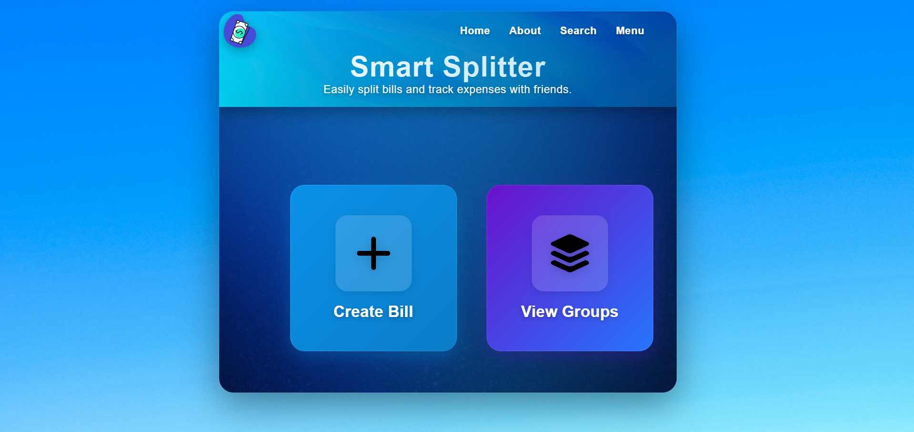
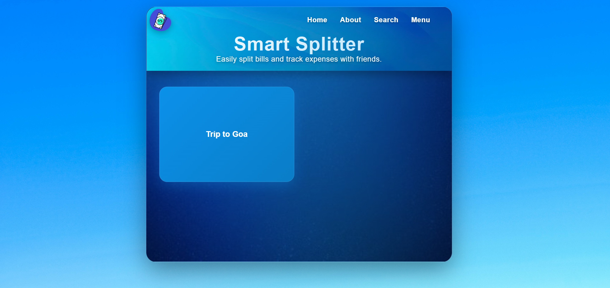
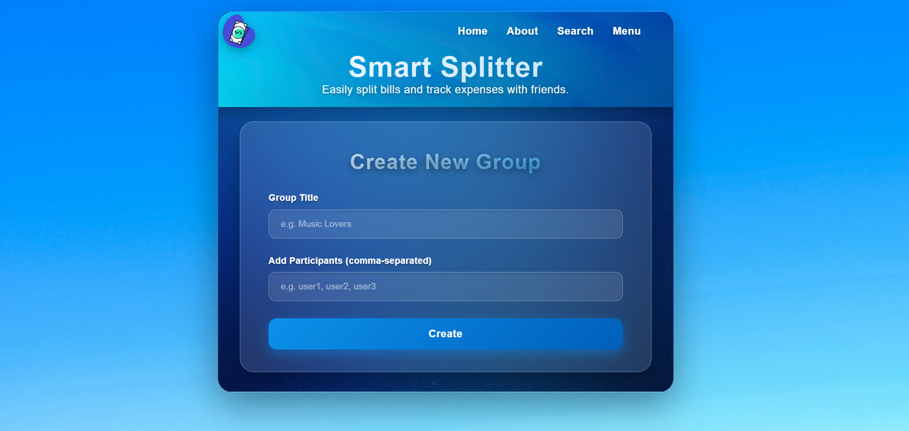

# 💰 Smart Splitter

> Easily split bills and track expenses with friends.

A modern, beautiful expense splitting application that helps you manage shared expenses with groups of friends. Track who owes what, split bills fairly, and keep everyone's finances organized.


<<<<<<< HEAD
## ✨ Features

=======
## 📸 Screenshots

<div align="center">

### 🏠 Home Page

*Clean and intuitive home screen with action cards*

### 👥 Groups List

*View all your expense groups at a glance*

### 💰 Group Management

*Add expenses, split bills, and view summaries*

</div>

---

## ✨ Features

>>>>>>> 65de0134741c9fd1179511e746bca486ae53a723
- 🎯 **Create Groups** - Organize expenses by creating groups with multiple participants
- 💸 **Split Expenses** - Add expenses and automatically split them among group members
- 📊 **View Summaries** - See who owes whom at a glance with detailed balance summaries
- 🎨 **Modern UI** - Beautiful, responsive design with smooth animations and glass morphism effects
- 🔐 **Secure Authentication** - Login system with JWT token authentication
- 📱 **Mobile Responsive** - Works seamlessly on desktop, tablet, and mobile devices

## 🚀 Quick Start

### Prerequisites

- Node.js (v14 or higher)
- npm or yarn
- MongoDB (for backend)

### Installation

1. **Clone the repository**
   ```bash
   git clone https://github.com/yourusername/smart-splitter.git
   cd smart-splitter
   ```

2. **Install dependencies**
   ```bash
   npm install
   ```

3. **Set up environment variables**
   
   Create a `.env` file in the root directory:
   ```env
   VITE_API_URL=http://localhost:5000
   ```

4. **Start the development server**
   ```bash
   npm run dev
   ```

5. **Open your browser**
   
   Navigate to `http://localhost:5173`

## 🏗️ Project Structure

```
smart-splitter/
├── src/
│   ├── components/
│   │   ├── Home.jsx          # Home page with action cards
│   │   ├── Groups.jsx         # Groups management page
│   │   ├── New.jsx            # Create new group page
│   │   ├── Navbar.jsx         # Navigation component
│   │   ├── home.module.css    # Home page styles
│   │   ├── group.module.css   # Groups page styles
│   │   ├── New.module.css     # New group styles
│   │   └── navbar.module.css  # Navbar styles
│   ├── assets/
│   │   ├── Logo2.svg
│   │   ├── add.svg
│   │   ├── group.svg
│   │   ├── cross.svg
│   │   └── bg*.jpg            # Background images
│   ├── utils/
│   │   └── fetchWithAuth.js   # API utility functions
│   ├── App.jsx
│   └── main.jsx
<<<<<<< HEAD
=======
├── screenshots/               # Screenshots for README
>>>>>>> 65de0134741c9fd1179511e746bca486ae53a723
├── package.json
└── README.md
```

## 🎮 Usage

### Creating a Group

1. Click on **"Create Bill"** from the home page
2. Enter a group title (e.g., "Trip to Goa", "Dinner Party")
3. Add participants as comma-separated names
4. Click **"Create"** to save the group

### Adding an Expense

1. Click on **"View Groups"** from the home page
2. Select a group from the list
3. Fill in the expense details:
   - Description (e.g., "Dinner", "Hotel")
   - Amount
   - Who paid
   - Who to split between
4. Click **"Add Expense"**

### Viewing Balances

1. Open a group
2. Click **"View Summary"**
3. See the simplified balance sheet showing who owes whom

### Deleting a Group

1. Open a group
2. Click the **"Delete Group"** button in the top-right corner
3. Confirm the deletion

## 🎨 Design Features

- **Glass Morphism** - Modern frosted glass effect throughout the UI
- **Gradient Backgrounds** - Beautiful color gradients on interactive elements
- **Smooth Animations** - Hover effects, transitions, and entrance animations
- **Responsive Grid** - Adaptive layouts that work on all screen sizes
- **Professional Typography** - Carefully chosen fonts and spacing
- **Enhanced Shadows** - Layered shadows for depth and dimension

## 🛠️ Technologies Used

### Frontend
- **React 18** - UI library
- **React Router** - Navigation
- **CSS Modules** - Scoped styling
- **Vite** - Build tool and dev server

### Backend (assumed)
- **Node.js** - Runtime environment
- **Express** - Web framework
- **MongoDB** - Database
- **JWT** - Authentication

## 📡 API Endpoints

```javascript
// Groups
GET    /api/groups           # Get all groups
POST   /api/groups           # Create a new group
DELETE /api/groups/:id       # Delete a group

// Expenses
POST   /api/expenses         # Add an expense
GET    /api/expenses/:groupId # Get group summary
```

## 🔒 Authentication

The app uses JWT token authentication stored in `localStorage`:
- Access token stored as `accessToken`
- User information stored as `user`

Protected routes automatically redirect to login if tokens are missing.

## 🎯 Future Enhancements

- [ ] Edit existing expenses
- [ ] Settle up payments
- [ ] Export expense reports
- [ ] Email notifications
- [ ] Multiple currency support
- [ ] Receipt upload
- [ ] Expense categories
- [ ] Dark/Light theme toggle
- [ ] Group chat functionality

## 🤝 Contributing

Contributions are welcome! Please feel free to submit a Pull Request.

1. Fork the repository
2. Create your feature branch (`git checkout -b feature/AmazingFeature`)
3. Commit your changes (`git commit -m 'Add some AmazingFeature'`)
4. Push to the branch (`git push origin feature/AmazingFeature`)
5. Open a Pull Request

## 📝 License

This project is licensed under the MIT License - see the LICENSE file for details.

## 👨‍💻 Author

**Deepak Sharma**
- GitHub: [@deepak-sh-07](https://github.com/deepak-sh-07)

## 🙏 Acknowledgments

- Design inspiration from modern fintech apps
- Icons from your custom asset library
- Background images for the beautiful UI

---

<div align="center">
<<<<<<< HEAD
Made with ❤️ by Your Name

⭐ Star this repo if you find it helpful!
</div>
=======

### 🌟 Show Your Support

Give a ⭐ if this project helped you!


</div>
>>>>>>> 65de0134741c9fd1179511e746bca486ae53a723
